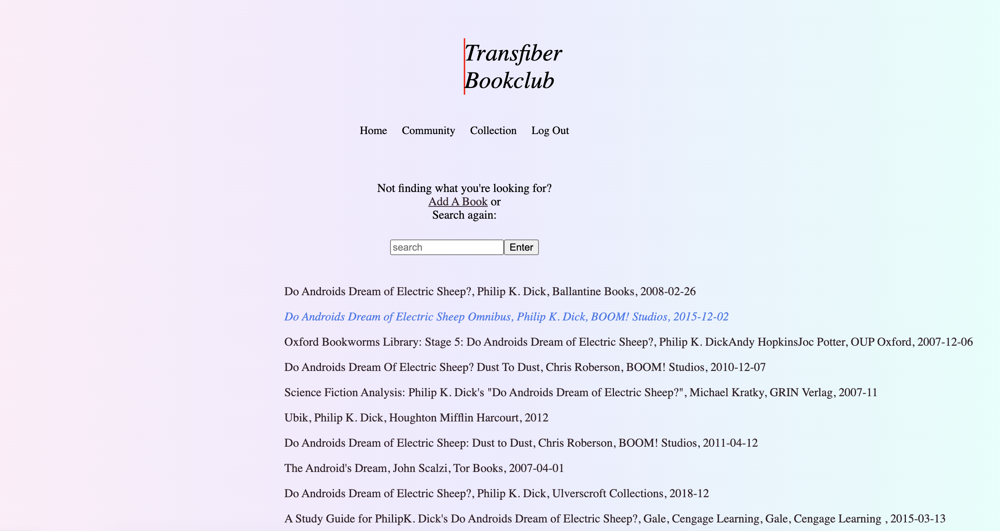
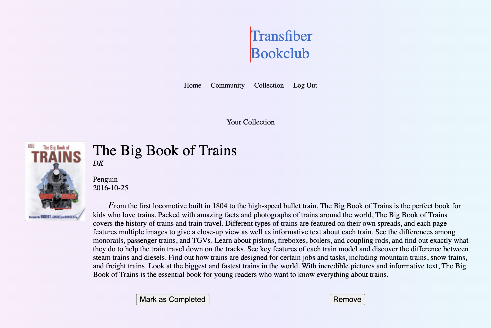
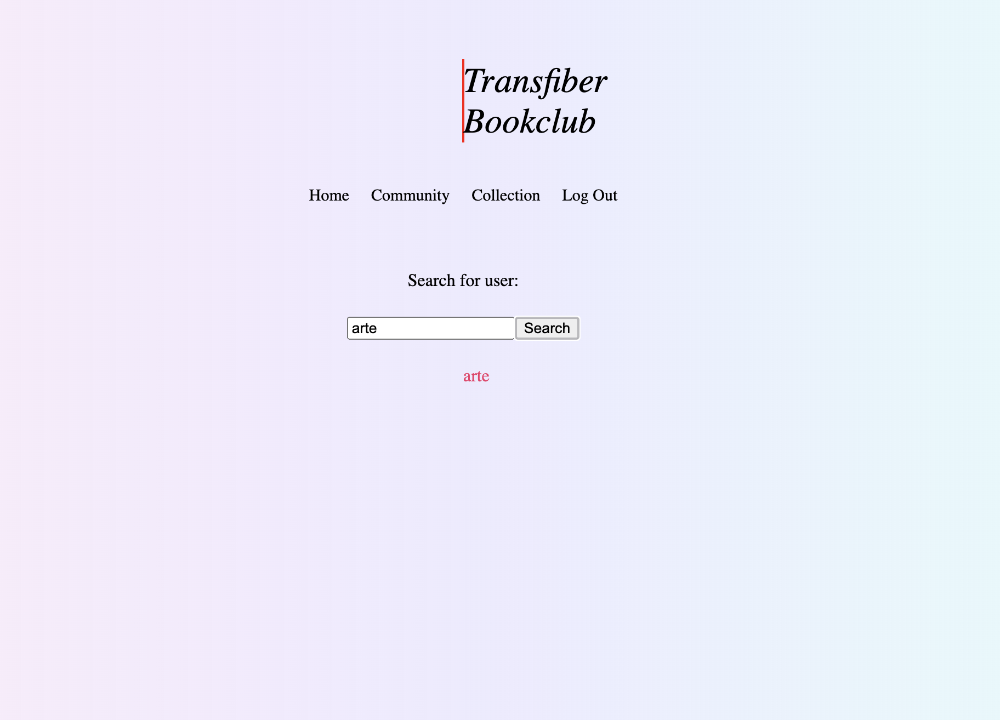
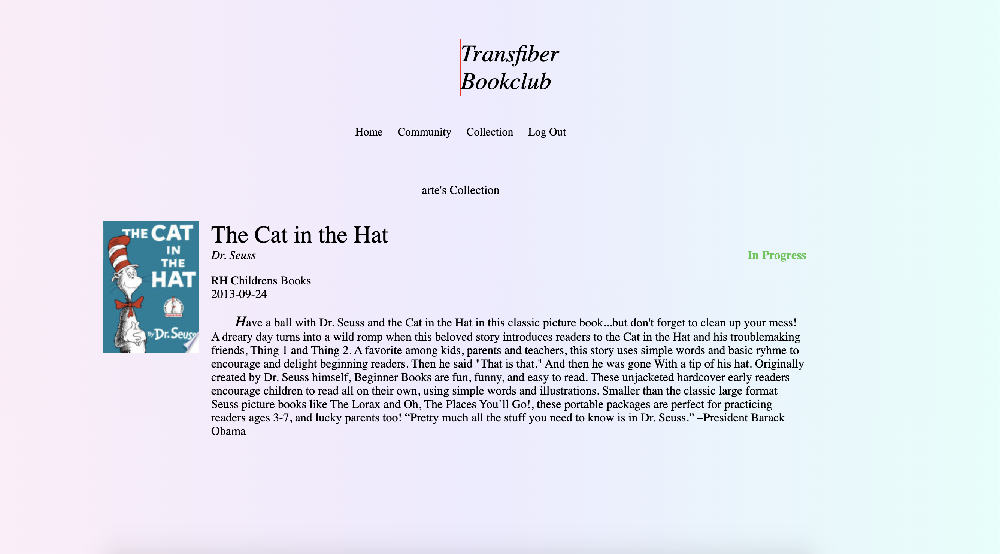

# Transfiber Bookclub

## Description

_Duration: 2 Weeks ~ 5 hours per week day_

The aim of this project was to create a CRUD (Create, Read, Update, Delete) app that would allow me to keep track of what books I'm reading and to see what books my friends are reading. The idea came from a weekend spent with a good friend -- we had so many things to share with so little time so we set an intention to keep track of things to share with each other.
The app needed a library of books to search through, a way to add a book to a collection, a way to update the status of a collected book, and an ability to see other user's collections. The Google Books API made it easy to access a library of books, but learning more complex database queries to create user collections was one of the largest challenges of the project. This was solved by performing multiple inserts in a query and returning data from the former insert into the latter. 

## Screen Shot

### Prerequisites

Link to software that is required to install the app (e.g. node).

- [Node.js](https://nodejs.org/en/)
- software for SQL database

## Installation

If your application has secret keys (for example --  Twilio), make sure you tell them how to set that up, both in getting the key and then what to call it in the `.env` file.

1. Create a Secret Key preferrably with a 16-key password generator and store in a .env file under the variable name SERVER_SESSION_SECRET.
2. Connect a Google Book API key to variable GOOGLE_API_KEY
3. Create a database called `transfiber_bookclub`
4. Then run the queries in the `database.sql` file
5. Open up the project in your edition and run an `npm install`
6. Run `npm run server` in your terminal
7. Run `npm run client` in your terminal
8. The `npm run client` command will open up a new browser tab for you!

## Usage
When using the app when not logged in, you can:
1. Login or Register with a user
2. View home page and search for books
3. View book details by clicking on search result text

When the user has registered or is logged in:
1. The user can search for books on the home page
2. By clicking search result text, the user can view the book details
3. The book details view will have button for the user to Add to Collection
4. The user can view books in the their collection by clicking the Collection link in the Nav bar.
5. On the Collection view, the user can remove a book from their Collection or Mark as Completed with their respective buttons.
6. The Community link in the Nav bar navigates the user to another search bar where the user can search for other users by username.
7. If the user search returns a match, it will be displayed with a link where the user can view the selected user's collection and whether they have Completed or are In Progress with the book.
8. When the user is finished using the app, they can use the Logout link in the Nav bar to sign out.

## Built With

React, Redux, Node, Express, & styled with CSS.

## Acknowledgement
Shout out [Prime Digital Academy](www.primeacademy.io) for equipping me with the skills to learn these technologies as well as my friends and family for supporting me on these long journeys with the computer!
